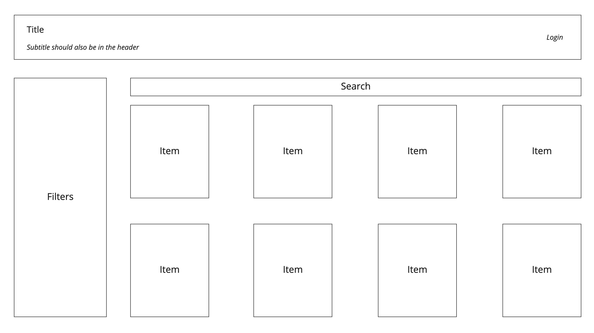
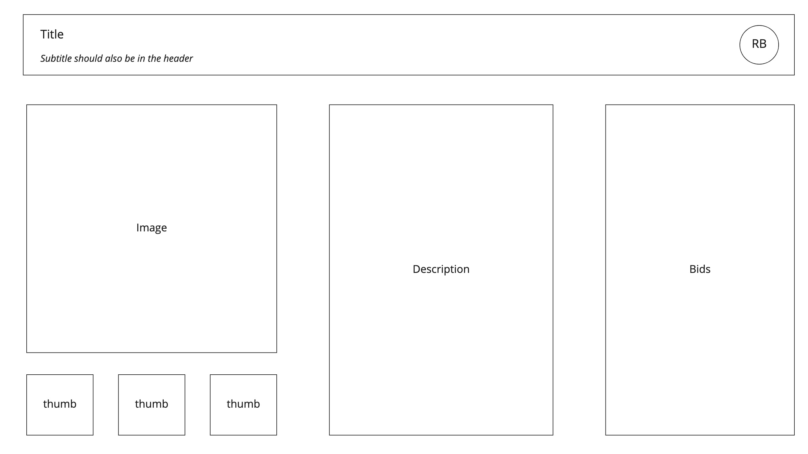
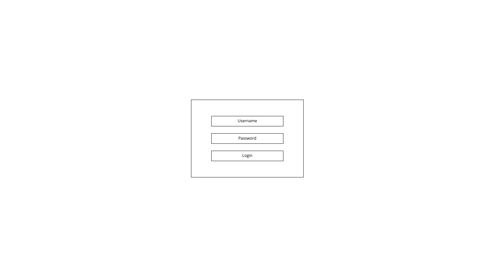
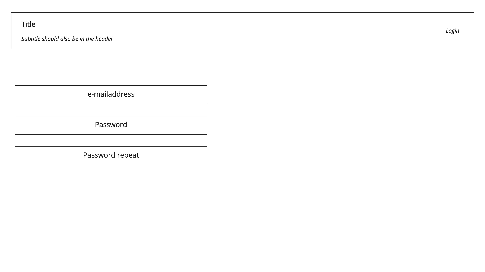

# Functional design

- [Introduction](./functional-design.md#introduction)
- [Requirements](./functional-design.md#requirements)
  - [Functional](./functional-design.md#functional)
  - [Non functional](./functional-design.md#non-functional)
- [User stories](./functional-design.md#userstories)
- [Wireframes](./functional-design.md#wireframes)

## Introduction

This documentation is a (partial) functional description for the 2.1 Webtechnology course.

In order to be graded you need to hand in a project consisting of both a front-end and backend as well as some 
documentation and tests.

The project is an auction site where administrators can add, remove and modify auction items. Site visitors can then
view the items up for auction. If they wish to place a bid they will need to log into the site. If they do not have an
account yet, they will have to register first.

Though the idea of an auction site is pre-determined you are free to choose the item type you are going to put up for
auction. Make sure you select a singe type of items. Also make sure the items you are going to put up for auction have
enough properties (or attributes) to filter. You will need at least three of them.

In the event something is unclear, or you have any questions, please let your teacher know.

## Requirements

The requirements for this project have been split into functional and non-functional requirements.

### Functional

- [ ] Display a list of auctionable products or services
- [ ] Of each of these products or services show at least the following:
  - [ ] Product or service name
  - [ ] The price (these should be integer values)
  - [ ] Who placed bids
  - [ ] When will the auction end
- [ ] It should be possible to search the list of auctions
- [ ] It should not be possible to remove or edit bids once they are made
- [ ] Input is validated client side before sending it to the server
- [ ] The server must perform server side validation
- [ ] The list of auctions should be filterable on at least three attributes that are logical for the chosen service or product. I.e.:
  - [ ] all trips in Twente 
  - [ ] all yellow sneakers
  - [ ] all paintings that are worth over 3 million euros

### Non functional

- [ ] The API is expected to return JSON, accompanied by an appropriate [HTTP status code](https://en.wikipedia.org/wiki/List_of_HTTP_status_codes)
- [ ] The REST API has to be designed using the most important REST principles:
  - [ ] HTTP request methods are used as intended. A GET request may never update a resource.
  - [ ] URI paths represent resources or a set of resources, not actions. POST /addProduct/ is not acceptable. 
  - [ ] Query parameters are meant for querying, so it should limit the results from a GET request. I.e. they can be used to filter certain values, sort or limit result sets by requesting only the first 10 results.
- [ ] All response bodies (including errors) must return valid JSON
- [ ] Correct HTTP status codes have to be returned for every request.
- [ ] Both the front-end and backend provide descriptive error messages: 'You already placed a bid', 'Bid already exists', 'User X not allowed to do ...'
- [ ] Both front-end and backend code is logically separated. Specifically for the Express routes (use multiple files)
- [ ] Endpoints have meaningful good and bad-weather tests
- [ ] After registration the user should be logged in. They should not have to log in again before being able to place a bid
- [ ] The front-end is build using Svelte
- [ ] The backend is built using Node js with Express

## Userstories

- [ ] As an administrator I want to be able to add, remove and modify auctions, so I can maintain the website
- [ ] As a user I want to be able to register (wth email-address and password), so I can use the website
- [ ] As an administrator I want to be able to log in, so I can maintain the auction site.
- [ ] As a user I want to be able to log in, so I can place bids
- [ ] As a user I want to be able to place a bid on an auction, so I have a chance of winning the item
- [ ] As a user I want to be able to remove my bid, so I can correct any mistakes 
- [ ] As I want to see a list of all auctions I won, so I can see how much I have to pay
- [ ] As a user I want to see a countdown of the number of days, hours, minutes and seconds I have left to bid

## Wireframes

Below are some wireframes providing an indication of how the website should look. Please keep in mind this is an 
indication. They are incomplete, and you are allowed to take some design liberties. 

Screens for managing users and items have been omitted.

### Homepage

The homepage should show a list of items up for auction. Users should be able to filter and search the items. If a user 
is not logged in the user should be able to log in. Items should link to the item details page.  

### Details

The details page should show the details of a single item up for auction. If a user is logged in they should have the 
option to place a bid. If not they should be able to log in. Please keep in mind that uploading images is not a part of
the assignment. You can use some default images for the items.

### Login

The login page should allow the user to log in.

### Register

The registration page should allow the user to enter their personal information, so they can place bids.