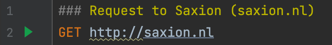
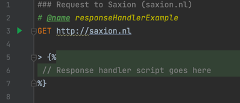
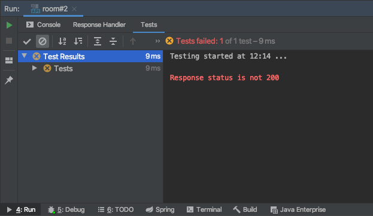

# Testing REST calls with IntelliJ

## Contents

- [Introduction](./README.md#introduction)
- [Using the RESTclient](./README.md#using-the-rest-client)
  - [Structure](./README.md#Structure)
  - [Using the results](./README.md#using-the-results)
- [Client object](./README.md#client-object)
- [Response object](./README.md#response-object)
- [Environments](./README.md#environments)
- [Links and references](./README.md#links-and-references)

 
## Introduction

The standard development environment is IntelliJ. It is a so called IDE or Integrated Development Environment. it is 
called integrated because it should have all the tools a developer should need to develop software.

So far you have mostly used Postman to make test calls to a backend. Even though Postman is a great tool, IntelliJ 
offers a similar option. One that offers benefits when working with IntelliJ. Using IntelliJ you can use plain text to
write the call you would like to make. This has several benefits:

- There is no need to import and export from other tools like Postman
- There is no need to switch between applications
- Any changes can be easily saved to version control like Git
- IntelliJ offers auto complete for writing out these calls
- Creating a resource and testing it go hand in hand. Other developers working on the code can easily get an idea of 
what is available and how it works.

These calls follow the [RFC2616 standard](https://ietf.org/rfc/rfc2616.txt). This makes it easy to port the calls to
other editors like Visual Studio Code.

On top of that IntelliJ allows you to add Javascript code to check the request result more in depth. The following 
chapters explain this in greater detail.

## Using the REST client

To create new calls a new `.rest` or `.http` file has to e created. Which file extension you pick is not important. 
IntelliJ treats them the same. We will be storing them in `/tests/rest`. Each file can contain multiple requests. Each 
request should be separated by `###`. This also functions as a comment so you can add additional documentation to a 
request.

### Structure

As stated the requests follow the [RFC2616 standard](https://ietf.org/rfc/rfc2616.txt). This means that each request has
a similar structure which is as follows.

```
Method Request-URI HTTP-Version
Header-field: Header-value

Request-Body

response handler script
```

A simple `GET` request to https://saxion.nl could look like this.



Notice the "play" button on line 2. It can be used to execute the request.

On the top of the editor another toolbar is visible.


The double "play" buttons can be used to run all requests in the file from top to bottom. This is also where an 
environment can be selected. Read more about environments [here](./README.md#Environments)

### Using the results

Though performing requests is a useful feature being able to interact with the responses of the requests is where it 
really shines. Just like in Postman it is possible to store response information in variables. Variables which can then 
be used. They can be used in other requests, think of retrieving an authentication token and sending it with subsequent
requests. But it is also possible to check the contents and see if they are what you expected.

IntelliJ calls the scripts used for this "response handler scripts". An example empty script is displayed below.



Within the response handler several objects are available to the developer. 
- `client` object, see [Http client reference](https://www.jetbrains.com/help/idea/http-client-reference.html)
- `response` object, see [Http response reference](https://www.jetbrains.com/help/idea/http-response-reference.html)

## Client object

The `client` object has a `global` property to which variables can be added. The `set` method can be used for this.

```
GET http://localhost:3000/token

> 
```

When the above request is performed the response handler will add the value `m1jnH3l3L4ng3en5uperV31l!geT0ken`
to `client.global` with the name `token`.

This token can then be used in all subsequent calls with `{{token}}`.

```
GET http://localhost:3000/resource
Content-Type: application/json
Authorization: Bearer {{token}}
```

In the call above `{{token}}` is set as the value for the `Authorization` header. Any value you would like to use in 
more than one place should be put in the `client` object.

## Response object

Besides the client object the "response handler script" exposes a `response` object. This object contains all 
information the client received (as a response) from the server. In the previous paragraph we hardcoded the `token` 
value. That is most likely not what we want. Chances are we would store information from the response. The example below 
show how this can be done.  

```
GET http://localhost:3000/token
Content-Type: application/json

> 
```

The above example expects the response to contain a JSON object in the body containing a key,  `token`. This token is 
then set on the `client` object which means it is available in subsequent calls.
Besides this, it is also possible to use the "response handler script" for testing. This makes it possible to test an 
entire API from within IntelliJ.

Below is an example test. It was meant to fail.

```http request
GET http://localhost:3000/test

> 
```

The call above will perform a test with the name 'Request executed successfully'. As part of this test a single `assert` 
is executed. In this case the test checks to see if `response.status` is not equal to `200`. The assert method will 
evaluate the first parameter and see if it is `true`. If it is not an exception is thrown with the second parameter as 
the message.



When executing REST calls IntelliJ will op the window `4:Run`. The "Tests" tab wil show the result of failing tests.

```http request
GET http://localhost:3000
Content-Type: application/json

> 
```

The above example will check that the response code is 200. After that the size of the response list is checked. 
According to the test the list should have a single item. Then it will loop through all the elements in the list and 
check if the name property of each item has a length greater than zero.

You might notice IntelliJ will complain about variable names. This is because IntelliJ cannot accurately determine 
types and content. However, if a body contains a JSON structure it can be treated as a JSON object as displayed above.


## Environments

Software is rarely developed on the same machine it is meant to run on in production. Even developers work on different
computers and might have different setups. To handle these differences environment files can be used.

An environment file contains configuration specific for a certain environment. Your own computer can be an environment
but mostly when talking about environments the OTAP (or DTAP in english) acronym is meant. Which stands for:
- Ontwikkeling (Development)
- Testing
- Acceptatie (Acceptance)
- Productie (production)

Each of these environments will have its own settings. The port number used for development might be different for 
testing and production. The environment file is where you define those differences and settings. 

Using the top bar in the REST file you can select and create environment files. An example is listed below.

```json
{
  "dev": {
    "protocol": "http://",
    "host": "localhost",
    "port": "3000"
  },
  "prod": {
    "protocol": "https://",
    "host": "www.my-awesome-api.com",
    "port": "3000"
  }
}
```

In the above example two environments are created (`dev` and `prod`). Each having their own settings (or variables).
These settings can be used in `.http` files as variables. A request using this environment file might look like this.

```http request
GET {{protocol}}{{host}}:{{port}}
Content-Type: application/json
```

This way, if the environment changes you will not have to search and replace all instances of a setting but you can 
simply change the values in the environment file.


## Links and references

- [IntelliJ Http client](https://www.jetbrains.com/help/idea/http-client-in-product-code-editor.html)
- [Microsoft best practices api-design](https://docs.microsoft.com/en-us/azure/architecture/best-practices/api-design)
- 